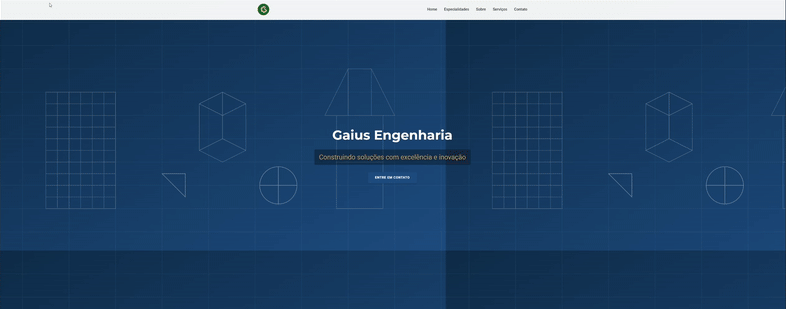

# 🌐 Gaius Engenharia - Landing Page

Este projeto é uma **Landing Page moderna e responsiva** desenvolvida para a empresa **[Gaius Engenharia](https://www.instagram.com/gaius_engenharia/)**, do Eng. **Caio Malheiros**.  

O objetivo foi criar uma presença digital com **design profissional inspirado em engenharia civil e construção**, utilizando cores sóbrias (azul, cinza e branco) para transmitir **credibilidade, inovação e solidez** — valores fundamentais no setor.

---

## 📖 Visão Geral
A landing page foi desenvolvida com foco em **impacto visual e usabilidade**, aplicando elementos modernos e opcionais em 3D para reforçar o conceito de inovação.  

---

## 🏗️ Estrutura da Página
- **Seção Hero**  
  Apresenta o nome da empresa, slogan e botão de chamada para ação.  
- **Sobre a Empresa**  
  Breve texto sobre a atuação da Gaius Engenharia, destacando projetos estruturais, soluções inovadoras e atendimento personalizado.  
- **Serviços**  
  Lista de serviços oferecidos pela empresa em cartões estilizados.  
- **Depoimentos (opcional)**  
  Espaço reservado para futuras avaliações de clientes.  
- **FAQ**  
  Acordeão dinâmico para responder dúvidas frequentes.  
- **Contato**  
  Formulário validado para envio de mensagens + links rápidos para WhatsApp e e-mail.  
- **Rodapé (Footer)**  
  Logo em versão reduzida, links rápidos e redes sociais.  

---

## ✨ Funcionalidades
- **Design moderno e responsivo** (desktop, tablet e mobile)  
- **Header fixo** com navegação fluida  
- **Animações suaves** (scroll reveal e interações em hover)  
- **Formulário de contato validado** (com integração a WhatsApp e e-mail)  
- **FAQ dinâmico** em acordeão  
- **Elementos opcionais em 3D** para reforçar o conceito de inovação  
- **Portfólio/galeria** preparado para expansão futura  

---

## 🛠️ Tecnologias Utilizadas
- **HTML5**  
- **CSS3 / TailwindCSS**  
- **JavaScript (ES6+)**  
- **SVG** para ícones e imagens vetoriais  
- (Opcional) **React + Vite** para componentização e manutenção escalável  

---

## 🎨 Identidade Visual
- **Paleta de cores**: azul petróleo, cinza neutro e detalhes em cobre/dourado  
- **Tipografia**:  
  - Títulos → **Poppins**  
  - Texto → **Inter**  
- **Inspiração visual**: projetos de engenharia civil, grids, estruturas técnicas e estética minimalista de construção moderna  

---

## 📸 Prévia do Projeto
(Adicione aqui prints ou um GIF da navegação pelo site)

```markdown

